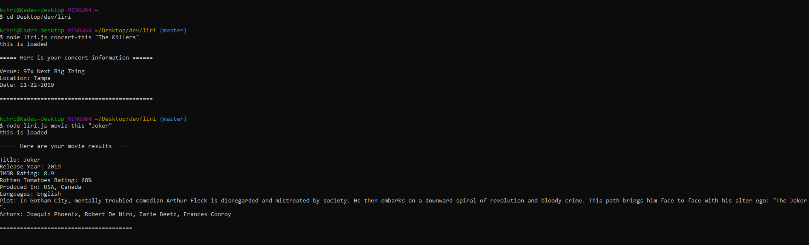

# Liri
LIRI (Language Interpretation and Recognition Interface) is a command line node app that takes in user input and gives back movie/song/concert data. 



## Getting Started
First, clone the repository to a local directory on your computer. To clone the repository, run the following command in your terminal/command prompt:

````
git clone https://github.com/KChristlieb/Liri.git
````

Then, change the directory to the project root directory (liri-node-app) and install the required npm packages using: 

````
npm install 
````
Finally, run liri.js by using node and passing in a command and an argument (as a string)

````
node liri.js *command* <"argument">
````

## Available commands
LIRI can perform 4 commands:

Command                                | Description
---------------------------------------|---------------------------------------
| spotify-this-song <"song name here"> | Shows information about the specified song. If no song is specified, FKJ's "Better Give U Up" is shown by default.
| concert-this <"artist name here">    | Shows concert information for the specified artist
| movie-this <"movie name here">       | Shows movie information for the specified movie. If no movie is specified, Back To The Future is shown by default.
| do-what-it-says                      | Reads the information in random.txt and displays movie info for "The Prestige"

## Technologies Used
* Javascript
* [Node.js](https://nodejs.org/en/)
* [Moment.js](https://momentjs.com/)